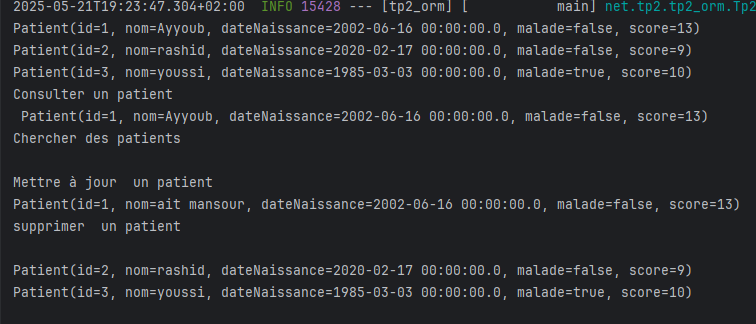

## Auteurs

- **Nom :** Ayyoub  
- **Prénom :** ait mansour  
- **Filière :** SDIA 
- **TP :** TP2 - JPA avec Spring Boot

<center> <h1>TP2 ORM - Gestion des Patients</h1>   </center>


## Configuration
### Version MySQL

`application.properties`:
```properties
spring.application.name=tp2_orm
server.port=8080
spring.datasource.url=jdbc:mysql://localhost:3306/patient
spring.datasource.username=root
spring.datasource.password=
spring.jpa.hibernate.ddl-auto=update
```
### Version H2
```
spring.application.name=tp2_orm
server.port=8087
spring.datasource.url=jdbc:h2:mem:patient
spring.h2.console.enabled=true
```

## Structure du projet
- `entities/Patient.java` : classe représentant l'entité Patient.
- `repository/PatientRepository.java` : interface qui gère les requêtes vers la base de données.
- `Tp2OrmApplication.java` : classe principale de l'application avec des tests dans `CommandLineRunner`.
- `application.properties` : configuration de la base de données et de JPA.
## Entité Patient
```
@Entity
@Getter @Setter @NoArgsConstructor @AllArgsConstructor @ToString @Builder
public class Patient {
    @Id
    @GeneratedValue(strategy = GenerationType.IDENTITY)
    private long id;
    private String nom;
    private Date dateNaissance;
    private boolean malade;
    private int score;
}
```
## interface PatientRepositor
```
public interface PatientRepository extends JpaRepository<Patient, Long> {
    List<Patient> findByNomIgnoreCase(String name);
    Patient findById(long id);


}
```
## Opérations réalisées
```
@Bean
	CommandLineRunner start(PatientRepository patientRepository) {
		return args -> {
			SimpleDateFormat sdf = new SimpleDateFormat("dd-MM-yyyy");
			// 1️⃣ Utilisation de @Builder
			Patient p1 = Patient.builder()
					.nom("Ayyoub")
					.dateNaissance(sdf.parse("16-06-2002"))
					.malade(false)
					.score(13)
					.build();
			patientRepository.save(p1);

			// 2️⃣ Utilisation de @AllArgsConstructor
			Patient p2 = new Patient(0, "rashid", sdf.parse("17-02-2020"), false, 9);
			patientRepository.save(p2);

			// 3️⃣ Utilisation de @NoArgsConstructor + setters
			Patient p3 = new Patient();
			p3.setNom("youssi");
			p3.setDateNaissance(sdf.parse("03-03-1985"));
			p3.setMalade(true);
			p3.setScore(10);
			patientRepository.save(p3);
			patientRepository.findAll().forEach(System.out::println);
			Patient p4= patientRepository.findById(p1.getId());
			System.out.println("Consulter un patient\n "+p4.toString());
			System.out.println("Chercher des patients\n");
			patientRepository.findByNomIgnoreCase("a").forEach(System.out::println);
			p4.setNom("ait mansour");
			patientRepository.save(p4);
			System.out.println("Mettre à jour  un patient\n"+p4.toString());
			System.out.println("supprimer  un patient\n");
			patientRepository.delete(p4);
			patientRepository.findAll().forEach(System.out::println);


		};
	}
```
## Resultat 
 
